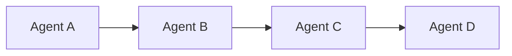
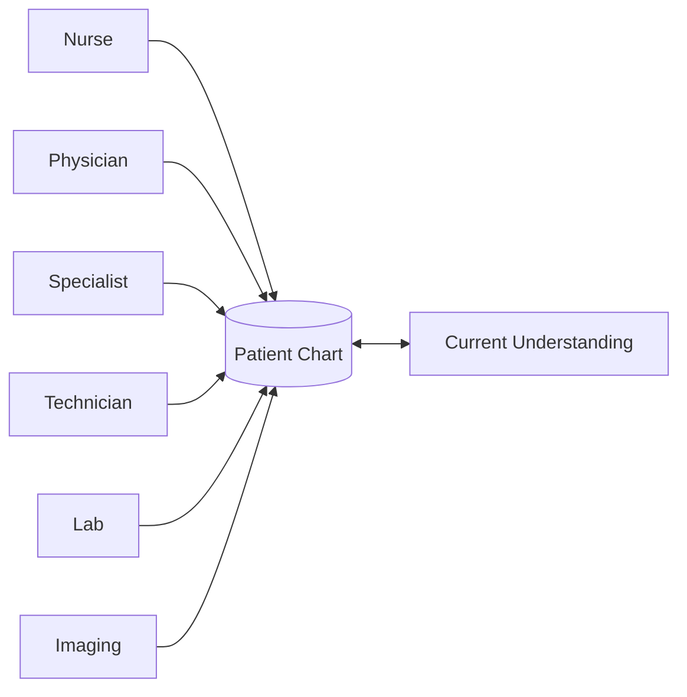
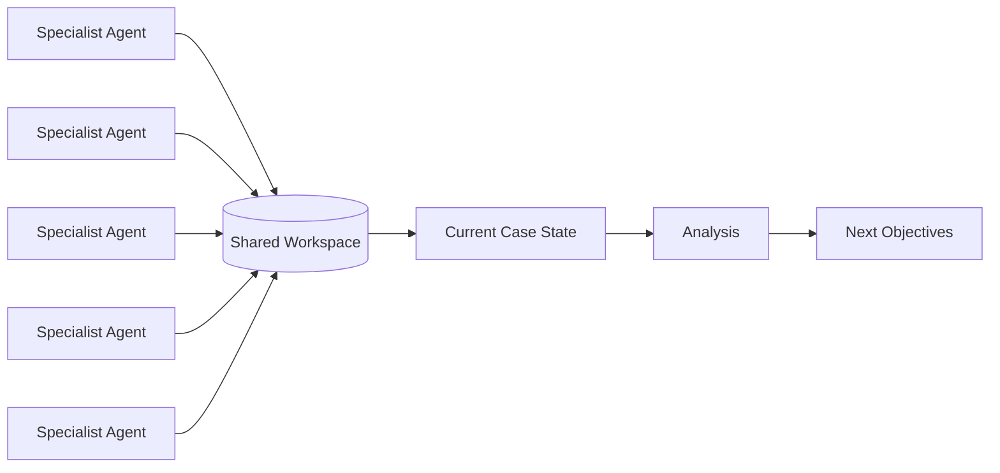
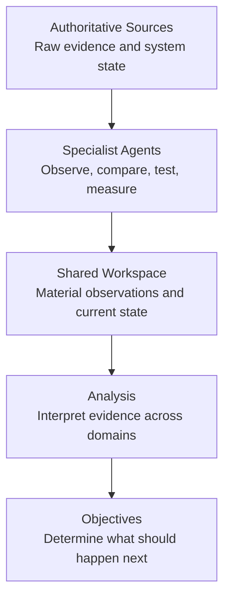
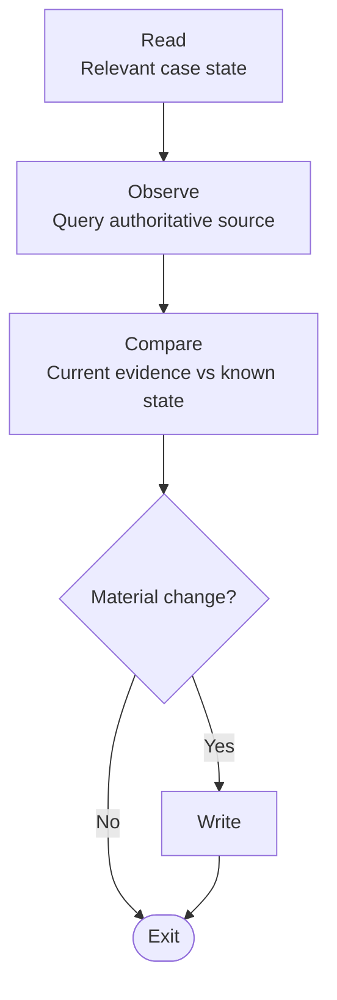

# AI Studio NetOps

# Patient Chart Multi-Agent Architecture

A general architecture for coordinating specialized AI agents through a persistent, structured workspace.

Traditional multi-agent systems often treat orchestration as a sequence of handoffs:

Each agent receives context from the previous agent, performs its task, and passes its understanding forward.

That works when the workflow is predictable. It becomes increasingly difficult when agents operate asynchronously, use different models, revisit the same problem over time, or need to incorporate information that did not exist when the workflow began.

This architecture takes a different approach:

> **Agents do not pass operational state to other agents. They contribute structured knowledge to a shared case.**

The workspace becomes the persistent coordination layer. Agents can be specialized and largely stateless because continuity exists outside of any individual agent or conversation.

## Inspired by Patient Care

This multi-agent orchestration architecture borrows principles from hospital and emergency-room operations.

A patient may be treated by nurses, physicians, specialists, technicians, pharmacists, and other caregivers over hours or days. Those participants do not need to continuously communicate everything they know directly to every person who may become involved later.

Instead, they contribute structured observations, measurements, assessments, interventions, and outcomes to a shared **patient chart**.

The chart provides continuity.

A specialist can enter the case, review the relevant history and current state, perform a specific task, contribute new information, and leave. Another specialist can continue the work later without requiring a direct handoff from everyone who participated before them.

The same principle can be applied to AI agents.

Agents distribute the work. The workspace preserves the knowledge.

## The Workspace as a Case Record

The workspace is not intended to become a copy of every system the agents interact with.

Authoritative systems continue to own their data. Agents retrieve that evidence when needed and contribute only the structured information required to advance the shared understanding of the case.

This creates three distinct layers:

The workspace therefore acts as an **information compression and continuity layer between source systems and reasoning models**.

Instead of repeatedly passing large amounts of raw data or conversational summaries between agents, specialists contribute structured information about what matters.

## A Common Agent Pattern

Most specialist agents can follow the same basic lifecycle:

This makes agent behavior predictable even when the agents use different tools, models, or areas of expertise.

The communication contract is the **data schema**, not the reasoning process of the previous model.

## Separation of Responsibilities

The architecture deliberately separates several functions:

**Evidence** — What authoritative systems report.

**Observation** — What a specialist determines is materially relevant.

**State** — What the case currently knows.

**Assessment** — What the accumulated evidence appears to mean.

**Plan** — What should be investigated or done next.

**Action** — What an authorized specialist actually changes.

This separation allows inexpensive or specialized models to perform continuous evidence gathering while higher-capability models are reserved for correlation, ambiguity, assessment, and planning.

It also allows agents using different models to cooperate without requiring those models to reason identically.

They only need to communicate through the same structured contract.

---

# Network Operations Implementation

This repository applies the Patient Chart architecture to network and infrastructure operations.

The shared case develops and maintains an understanding of the environment across operational health, compliance, infrastructure state, testing, change, incidents, and modernization.

Individual agents, skills, and tools implement these capabilities without requiring the rest of the system to understand their internal workflows.

[Read the full architecture →](documentation/patient-chart.md)

## State of the Environment

A maintained analysis of what the current environment looks like.

The goal is not to continuously copy source-system data into the workspace. The system records material observations, changes, assessments, and current state so that other workflows have a concise and durable understanding of the environment.

### Health

Health combines observations from operational sources into a current assessment of the environment.

Specialists compare live information with previous observations and record meaningful changes. A higher-level analyzer correlates those observations using a SOAP-inspired model to maintain an assessment and actionable objectives.

**Question answered:**
*What is happening in the environment, what changed, and what requires attention?*

[Health architecture →](documentation/health-agents.md)

### Compliance

Compliance maintains both **coverage** and **posture**.

Coverage determines whether the environment is testing the controls that are relevant to the infrastructure actually deployed. Posture determines whether those implemented checks currently pass.

Published controls remain external, implemented checks live in Git, and detailed execution evidence remains with test results. The workspace maintains the meaningful compliance state and changes needed by higher-level analysis.

**Questions answered:**
*Are we testing the right things?*
*Are the things we test currently passing?*

[Compliance architecture →](documentation/compliance-agents.md)

---

## Source of Truth and Digital Twin

Maintains the infrastructure model required to understand and safely reproduce the environment.

GitHub owns approved network configuration. NetBox maintains infrastructure identity and relationships such as devices, interfaces, IP addresses, and cables. CML provides a digital twin constructed from those approved sources.

The digital twin is a test environment, not an independent source of truth.

**Question answered:**
*What infrastructure exists, how is it connected, and can we reproduce it?*

[SoT and Digital Twin architecture →](documentation/sot-and-twin-agents.md)

---

## Change and Validation

Turns an intended infrastructure change into something that can be evaluated, tested, and safely applied.

Proposed changes are developed against known environment state, validated using the available testing infrastructure, and applied through the Git-based configuration workflow.

Testing produces evidence and risk information rather than silently authorizing production changes.

**Question answered:**
*Can we make this change, what does it affect, and what evidence do we have that it is safe?*

[Change and testing architecture →](documentation/change-and-test-agents.md)

[Network operations architecture →](documentation/network-ops.md)

---

## Incident and Workflow Integration

Connects operational understanding with external workflow systems such as ServiceNow.

Tickets remain authoritative in their source platform. Relevant incident and workflow information can contribute to the shared understanding of the environment without duplicating the external system in the workspace.

**Question answered:**
*What operational work is already underway, and how does it relate to the current environment?*

[ServiceNow architecture →](documentation/servicenow-agents.md)

---

## Modernization

Uses the accumulated understanding of the environment to support longer-term infrastructure decisions.

Current infrastructure, lifecycle information, support status, topology, and other relevant evidence can be combined into modernization analysis and roadmap recommendations.

**Question answered:**
*Given what exists today, what should the environment become over time?*

[Modernization architecture →](documentation/modernization-agents.md)

---

# Architectural Principles

Across these capabilities, the same rules apply:

1. **State belongs to the case, not the agent.**
2. **Source systems remain authoritative.**
3. **Schemas are the communication contract.**
4. **Record meaningful change instead of copying source data.**
5. **Separate evidence from interpretation.**
6. **Keep detailed evidence outside reasoning context until it is needed.**
7. **Use higher-capability models where correlation and interpretation add value.**
8. **Do not make continuity dependent on agent execution order.**
9. **Keep specialist responsibilities narrow.**
10. **A new conversation must be able to resume from the shared record.**

The result is a system in which agents can remain specialized and largely stateless while the platform maintains a persistent understanding of the infrastructure.
