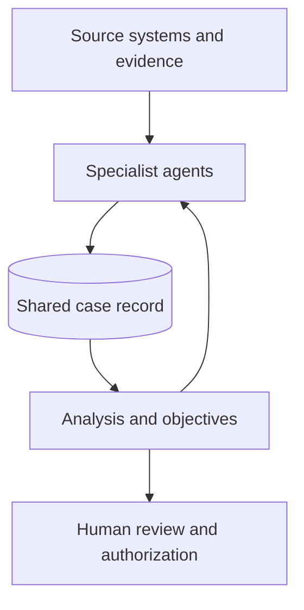

# AI Studio NetOps

Agents carry out the work. The case record carries the continuity.

A patient chart for agents working on the same problem.

[The idea](#the-patient-chart) · [A case in motion](#a-case-in-motion) · [Why it breaks](#where-coordination-breaks-down) · [This repository](#how-this-repository-applies-the-idea) · [Principles](#principles)

**What happens when the next agent arrives after the first agent’s context is gone?**

Imagine a patient arriving at a hospital. A nurse takes vital signs. A technician runs tests. A specialist reviews the results. The physician makes a decision. Hours later, another team takes over.

The patient should not have to start the story over every time a new person enters the room. The care team needs a chart: a record of what was observed, what it might mean, what was done, and what still needs attention.

**AI Studio applies that idea to agents.** Each specialist can enter a case, do its work, update a shared record, and leave. The next agent begins with the current state of the case rather than a retelling of the previous agent's conversation.

**A note on the idea:** This is an observation about how people coordinate important work, applied to how agents interact. It does not require a new model or a complex orchestration framework. This repository shares patterns and examples you can adapt to improve continuity, handoffs, and decision-making in your own agent system.

## The patient chart

That shared chart maintains continuity across shifts and specialties. A lab result is distinguishable from a diagnosis; an intervention is distinguishable from the outcome it produced. That discipline matters because missing or misunderstood information can affect care.

That gives AI Studio a practical design rule:

> [!IMPORTANT]
> **Agents carry out the work. The case record carries the continuity.**

An agent reads the relevant case state, gets fresh evidence from an authoritative source, compares it with what is already known, and records a material observation or assessment with a reference to its evidence. An analyzer can then connect findings across specialties and propose the next objective. A later agent can pick up that objective without replaying every conversation.



The chart is not a copy of every source system. Raw telemetry, configurations, ticket details, and test output remain with their owners. The case record stores concise findings, references, current understanding, open questions, recommendations, actions, and outcomes. Its structure lets different models work together without needing to reason the same way.

### A case in motion

Consider an illustrative branch outage. At 9:02, a monitoring agent detects packet loss. At 9:04, a topology agent identifies the affected WAN path. At 9:07, a configuration agent notes a routing change on that path. An analyst joins at 9:12. It can inspect the accumulated findings, follow their source references, and distinguish a plausible cause from a confirmed one. None of the specialists needed to run in a predetermined order.

A compact chart might expose the following view to the analyst. The example is illustrative; it shows the information contract, not a required file schema:

```yaml
case: branch-wan-degradation
current_summary: Packet loss on the branch WAN path; cause unconfirmed.
observations:
  - at: "09:02"
    agent: monitoring
    finding: Packet loss rose above the expected baseline.
    source_ref: telemetry/branch-wan/09-02
  - at: "09:04"
    agent: topology
    finding: The affected path traverses WAN-01 Gi1.
    source_ref: inventory/branch-wan-path
  - at: "09:07"
    agent: configuration
    finding: A routing change was applied to WAN-01 before the loss began.
    source_ref: changes/CHG0012345
assessment:
  hypothesis: The routing change may be related to the loss.
  status: unconfirmed
next_objective: Validate the path and compare behavior before and after the change.
```

The timestamps and findings tell the story; the references let a specialist inspect the underlying evidence. If a later test rules out the routing change, the chart can preserve that outcome and update the current assessment. The next agent advances the case instead of repeating the investigation.

## Why orchestrate agents?

A single agent with good tools can accomplish a great deal. But some objectives span different systems, skills, and time horizons. Diagnosing a network problem, for example, may involve telemetry, topology, configuration, incidents, compliance checks, and a change tested in a digital twin. Specialists can investigate those parts independently, then contribute to a decision about the whole.

Multi-agent orchestration makes that division of work possible. **Its value comes from coordinating specialized work toward a larger objective**, particularly when tasks can happen in parallel or require distinct expertise and context. More agents alone do not guarantee a better answer; they also create more coordination work.

## Where coordination breaks down

| Failure | What goes wrong |
| --- | --- |
| **Context continuity** | An agent's conversation is a poor permanent record. Context can grow, get compressed, expire, or become unavailable when a different agent or model takes over. A team needs a durable account of what it currently knows and why. |
| **Handoffs create rework** | If the next specialist receives only a summary of the previous specialist's reasoning, it may need to rediscover evidence, repeat tests, or guess which claims were observations and which were interpretations. Direct handoffs are useful for delegation; they should not be the only place the case exists. |
| **Reality does not arrive in a fixed order** | A linear workflow assumes that agent A finishes before B starts and that C receives everything it needs from B. In operations, a new alert, test result, incident update, or human request may arrive at any time. Agents need to join, revisit, or resume a case when their expertise is needed. |

## What this design aims to achieve

| Goal | Design choice |
| --- | --- |
| **Accuracy as the stakes rise** | Separate evidence, observations, assessments, plans, and actions. Keep source references so a decision can be checked. Require validation and authorization before consequential changes. |
| **Lower token use** | Put durable case state outside model conversations. Share concise, relevant updates and retrieve detailed evidence only when needed. Assign repeatable tasks to suitable local or lower-cost models and reserve stronger models for difficult synthesis. |
| **Flexible execution** | Give each specialist the same read–observe–compare–write contract so it can run on demand, on a schedule, in response to an event, or within an orchestrated workflow. |

These are architectural goals, not measured performance claims. Accuracy and cost still need to be evaluated against the tasks and models used.

## What this enables

- **Continuity across sessions and models.** A new specialist can resume from the shared case instead of depending on a prior conversation.
- **Less repeated investigation.** Findings point to evidence and show what changed, so agents can focus on new work.
- **Agents that run when needed.** Specialists can respond to events or requests without waiting for a fixed chain of agents.
- **More deliberate model selection.** Routine observation and structured updates can use an appropriate lower-cost model; complex correlation can use a stronger one.
- **A clearer path from finding to action.** Observations, interpretations, recommendations, validation results, and authorized changes remain distinguishable.
- **Portable specialist roles.** Tools and models can change while the case schema remains the contract between agents.

---

## How this repository applies the idea

This repository explores the patient chart pattern for network and infrastructure operations. Health, compliance, inventory, digital twins, change validation, incidents, and modernization can each contribute to the same understanding of an environment.

The shared case records material observations, changes, assessments, and current state so other workflows have a concise and durable understanding of the environment. Individual agents, skills, and tools implement these capabilities without requiring the rest of the system to understand their internal workflows.

| Capability | Question it helps answer | Design notes |
| --- | --- | --- |
| Health | What changed, and what needs attention? | [Health agents](documentation/health-agents.md) |
| Compliance | Are relevant controls covered, and are implemented checks passing? | [Compliance agents](documentation/compliance-agents.md) |
| Source of truth and digital twin | What exists, how is it connected, and can it be reproduced for testing? | [SoT and twin agents](documentation/sot-and-twin-agents.md) |
| Change and validation | What will a change affect, and what does testing show? | [Change and test agents](documentation/change-and-test-agents.md) |
| Incidents and workflow | What work is already underway, and how does it relate to the case? | [ServiceNow agents](documentation/servicenow-agents.md) |
| Modernization | Given the current environment, what should change over time? | [Modernization agents](documentation/modernization-agents.md) |

GitHub holds approved network configuration; NetBox describes infrastructure identity and relationships; CML hosts a digital twin for testing. Source platforms remain authoritative for their own data. The shared case records what agents learned from them and what that means for the work ahead.

[Read the patient chart architecture](documentation/patient-chart.md) · [Explore the network operations design](documentation/network-ops.md)

### Capability details

<details>
<summary><strong>Health</strong> — What is happening, what changed, and what requires attention?</summary>

Health combines observations from operational sources into a current assessment of the environment.

Specialists compare live information with previous observations and record meaningful changes. A higher-level analyzer correlates those observations using a SOAP-inspired model to maintain an assessment and actionable objectives.

**Question answered:**
*What is happening in the environment, what changed, and what requires attention?*

[Health architecture →](documentation/health-agents.md)

</details>

<details>
<summary><strong>Compliance</strong> — Are we testing the right things, and are those checks passing?</summary>

Compliance maintains both **coverage** and **posture**.

Coverage determines whether the environment is testing the controls that are relevant to the infrastructure actually deployed. Posture determines whether those implemented checks currently pass.

Published controls remain external, implemented checks live in Git, and detailed execution evidence remains with test results. The workspace maintains the meaningful compliance state and changes needed by higher-level analysis.

**Questions answered:**
*Are we testing the right things?*
*Are the things we test currently passing?*

[Compliance architecture →](documentation/compliance-agents.md)

</details>

<details>
<summary><strong>Source of truth and digital twin</strong> — What exists, how is it connected, and can we reproduce it?</summary>

Maintains the infrastructure model required to understand and safely reproduce the environment.

GitHub owns approved network configuration. NetBox maintains infrastructure identity and relationships such as devices, interfaces, IP addresses, and cables. CML provides a digital twin constructed from those approved sources.

The digital twin is a test environment, not an independent source of truth.

**Question answered:**
*What infrastructure exists, how is it connected, and can we reproduce it?*

[SoT and Digital Twin architecture →](documentation/sot-and-twin-agents.md)

</details>

<details>
<summary><strong>Change and validation</strong> — What will a change affect, and what does testing show?</summary>

Turns an intended infrastructure change into something that can be evaluated, tested, and safely applied.

Proposed changes are developed against known environment state, validated using the available testing infrastructure, and applied through the Git-based configuration workflow.

Testing produces evidence and risk information rather than silently authorizing production changes.

**Question answered:**
*Can we make this change, what does it affect, and what evidence do we have that it is safe?*

[Change and testing architecture →](documentation/change-and-test-agents.md)

[Network operations architecture →](documentation/network-ops.md)

</details>

<details>
<summary><strong>Incidents and workflow</strong> — What work is already underway, and how does it relate to the case?</summary>

Connects operational understanding with external workflow systems such as ServiceNow.

Tickets remain authoritative in their source platform. Relevant incident and workflow information can contribute to the shared understanding of the environment without duplicating the external system in the workspace.

**Question answered:**
*What operational work is already underway, and how does it relate to the current environment?*

[ServiceNow architecture →](documentation/servicenow-agents.md)

</details>

<details>
<summary><strong>Modernization</strong> — Given what exists today, what should the environment become?</summary>

Uses the accumulated understanding of the environment to support longer-term infrastructure decisions.

Current infrastructure, lifecycle information, support status, topology, and other relevant evidence can be combined into modernization analysis and roadmap recommendations.

**Question answered:**
*Given what exists today, what should the environment become over time?*

[Modernization architecture →](documentation/modernization-agents.md)

</details>

## Principles

1. State belongs to the case, not an individual agent.
2. Source systems remain authoritative; the chart records meaningful findings and references.
3. Schemas define the communication contract between specialists.
4. Evidence, observation, assessment, plan, action, and outcome are distinct.
5. Agents can contribute in different orders as new information arrives.
6. Expensive reasoning is used where interpretation adds value.
7. A new conversation should be able to resume from the case record.

The aim is a system that can bring the right specialist into a case at the right time, preserve what the team has learned, and make each subsequent decision better informed.
