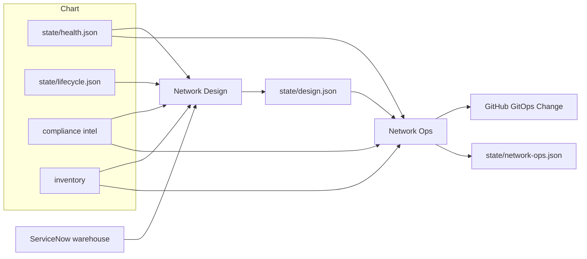

# Change and Test Agents

Network Design is the long-horizon designer. It reads the chart
and writes a roadmap at **hardware, software, configuration, and
compliance**. It checks warehouse stock and coordinates when
asked. It does not change boxes.

[Network Ops](network-ops.md) implements running-config fixes
from evidence (failed tests, missing stanzas vs peers) through
git. The suite run is [Compliance Test](compliance-agents.md).

## Agents

| Agent | Role |
|-------|-------|
| Network Design | Hardware (order because EoS), software (patch because PSIRT), long-horizon configuration and compliance. Warehouse check; reserve/REQ/CHG when they coordinate. Writes `state/design.json` and `design/roadmap.md`. |
| Network Ops | Frontier decision maker: exact bounded prescription → local GitOps worker → merge `main` on live pass → replace concise `state/network-ops.json`. |
| GitHub GitOps Change | Local worker: read/edit full configs, put `dev`, poll exact `apply.yml` run, return compact evidence and write one `operational/runs/<stamp>.json`. |
| Pipeline Monitor | Watch `apply.yml` / `test.yml` by git ref, judge the marker, and write one concise `operational/runs/<stamp>.json`. |
| Compliance Author | Turns compliance intel or a named ask into a complete check/rule, bridge, matrix, and catalog chain in git. |
| Compliance Test | Triggers `test.yml`, records risk, writes `operational/testing/<stamp>.json` and current `state/testing.json`. |

Every structured workspace write carries top-level `keys`, with nested
data-point keys retained. Recommendations and plans remain agent outputs;
only stable operational identities participate in relationship joins.

## What the roadmap looks like

All four layers every Design invoke. Each item names targets,
why, date, and steps. Empty layer only if nothing to do — still
say why. One timeline across the four. Warehouse: asset tag,
model, and serial together. Lab images are not orderable
models.

Ops does not wait for a Design `configuration[]` row. Config
changes prove on git `dev` (Dev lab), then a PR to `main`.

Design does not collect Splunk, ThousandEyes, or Cisco EoX.
It does not run the ServiceNow desk (assign / KB). Warehouse
and catalog order **are** this agent.
