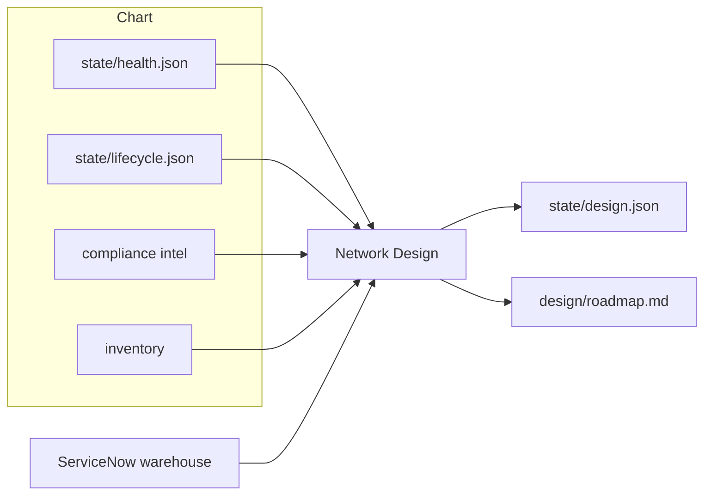

# Change and Test Agents

Network Design is the designer. It reads the whole chart and
writes a roadmap at **hardware, software, configuration, and
compliance**. It checks warehouse stock on ServiceNow and
coordinates when asked. The suite run is
[Compliance Test](compliance-agents.md). It does not replace
[Health Agents](health-agents.md),
[Modernization Agents](modernization-agents.md), or
[SoT and Twin](sot-and-twin-agents.md) — it uses their files.

## Agents

| Agent | Role |
|-------|------|
| Network Design | Hardware (order because EoS), software (patch because PSIRT), configuration (latency/path/flap), compliance (out of compliance — update). Warehouse check; reserve/REQ/CHG when they coordinate. Writes `state/design.json` and `design/roadmap.md`. |
| Compliance Author | Turns compliance intel or a named ask into a check in git. |
| Compliance Test | Triggers `test.yml`, records risk, writes the timestamped result. |

## What the roadmap looks like

All four layers every invoke. Each item names targets, why,
date, and steps. Empty layer only if nothing to do — still
say why. One timeline across the four. Warehouse: asset tag,
model, and serial together. Lab images are not orderable
models. SKUs and trains come from the lifecycle row or from
stock actually found.

Config changes prove on Dev, then prod. A drifted twin is
not evidence — [SoT and Twin](sot-and-twin-agents.md).

Design does not collect Splunk, ThousandEyes, or Cisco EoX.
It does not run the ServiceNow desk (assign / KB). Warehouse
and catalog order **are** this agent.
