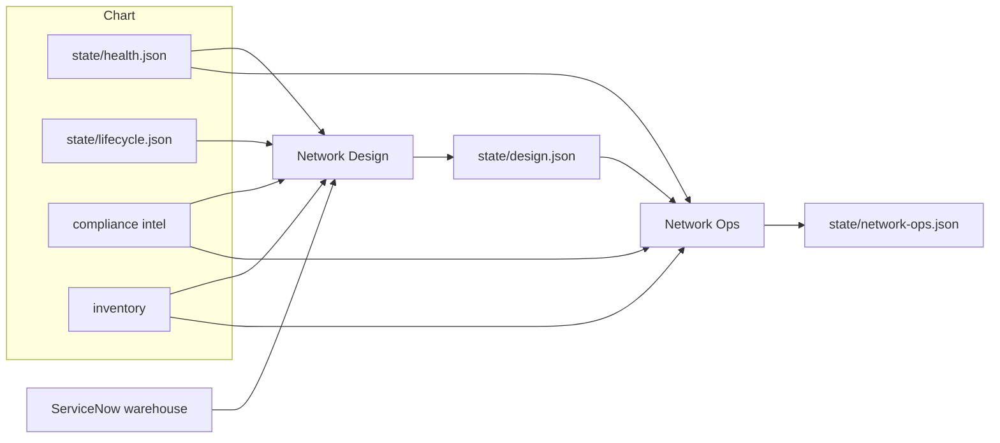

# Change and Test Agents

Network Design is the long-horizon designer. It reads the chart
and writes a roadmap at **hardware, software, configuration, and
compliance**. It checks warehouse stock and coordinates when
asked. It does not change boxes.

[Network Ops](network-ops.md) implements running-config fixes
from evidence (failed tests, missing stanzas vs peers) through
git. The suite run is [Compliance Test](compliance-agents.md).

## Agents

| Agent | Role |
|-------|-------|
| Network Design | Hardware (order because EoS), software (patch because PSIRT), long-horizon configuration and compliance. Warehouse check; reserve/REQ/CHG when they coordinate. Writes `state/design.json` and `design/roadmap.md`. |
| Network Ops | Operate: specific config from SoT + evidence → git `dev` → GitOps → merge `main`. Writes `state/network-ops.json`. |
| Pipeline Monitor | Watch `apply.yml` / `test.yml` by git ref. Marker, not the green check. Writes nothing. |
| Compliance Author | Turns compliance intel or a named ask into a check in git. |
| Compliance Test | Triggers `test.yml`, records risk, writes the timestamped result. |

## What the roadmap looks like

All four layers every Design invoke. Each item names targets,
why, date, and steps. Empty layer only if nothing to do — still
say why. One timeline across the four. Warehouse: asset tag,
model, and serial together. Lab images are not orderable
models.

Ops does not wait for a Design `configuration[]` row. Config
changes prove on git `dev` (Dev lab), then a PR to `main`.

Design does not collect Splunk, ThousandEyes, or Cisco EoX.
It does not run the ServiceNow desk (assign / KB). Warehouse
and catalog order **are** this agent.
