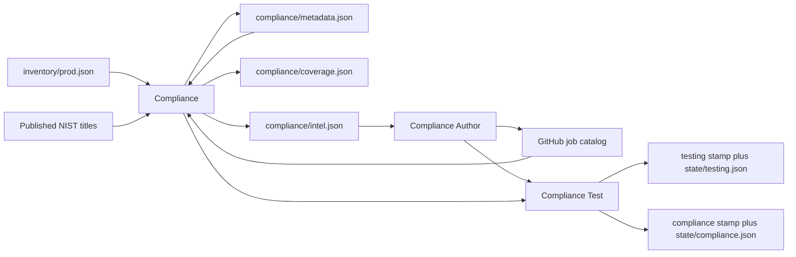

# Compliance Agents

Three jobs, three agents. Compliance decides what published rules
apply to **this** network and are not in the catalog. Compliance
Author writes a check into git. Compliance Test runs the suite and
records risk.

A default scan fingerprints the framework, estate, and git catalog,
reconciles open INTEL candidates against git, does only the work
those fingerprints require, then hands Author and Test the queue
when it is not empty. “Report only” or “intel only” stops after
reading or writing intel.

## Agents

| Agent | Role |
|-------|------|
| Compliance | Newly published controls vs this estate and the catalog. Keep the delta. Rank what we still need. Delegate Author, then Test. |
| Compliance Author | Turn ranked intel into checks in git and update the catalog. Do not run the suite. |
| Compliance Test | Trigger `test.yml`, read the job-log marker, write the run files and a risk call. |

## Compliance

Reads the job catalog from GitHub (`catalog/job-catalog.json`).
That is the checks we already run. It does not copy git into the
workspace. It does not read running-configs.

It reads `inventory/prod.json` so it knows what *kinds* of things
we have (network gear vs endpoints vs SaaS). That filter is why a
laptop or server control is not a candidate. It stores input
fingerprints in `compliance/metadata.json` so the next visit does
not re-skim NIST when the pin, the estate, and the catalog have
not changed.

Every scheduled visit still fetches the live catalog and
**reconciles** `intel.json`: if an INTEL row is now mapped on a
catalog check (`nist:`), drop it and refill the queue (cap 5) from
gaps already on `coverage.json`.

Then fingerprints choose the rest of the work:

| What changed | What Intel does |
|--------------|-----------------|
| Framework (OSCAL pin/index) or first visit | Skim published titles. Rebuild coverage. |
| Estate only | Rejudge applicability on existing coverage rows. No family skim. |
| Catalog only | Join `nist:` tags onto coverage. Drop covered candidates. Refill. |
| None | Reconcile only. Do not rewrite coverage/intel if the queue did not move. |

It interprets each title it actually considers:

- Already mapped on a catalog check (`nist:`) — covered. Not a gap.
- Applies to these routers / switches / WAN / mgmt plane — relevant
  missing. That is the delta.
- Only makes sense for servers, endpoints, or SaaS, and we have
  none — not applicable. Recorded on `skipped_non_network` with why.

A server-access control is not a candidate just because NIST
published it.

It writes:

- `compliance/coverage.json` — covered / partial / gap for what
  applies here (when coverage changed).
- `compliance/intel.json` — up to five **proposed** candidates,
  sorted by criticality (`critical`, `high`, `medium`, `low`), plus
  `delta` (catalog covered vs relevant missing vs not applicable).
- `compliance/metadata.json` — hashes of the three inputs from the
  last successful evaluation. Not NIST. Not a catalog copy.

It does not write checks and it does not run them. After a default
scan with candidates still in the queue, it invokes Compliance
Author (ranked list), waits, then Compliance Test
(`suites=compliance`) and waits. If those agents are not attached,
it names them and stops. An empty queue after reconcile does not
invoke Author.

## Compliance Author

Workspace is input (`compliance/intel.json` or a sentence). Checks
live in git. Before it writes a check it reads inventory and a
committed running-config from git (`inventory/configs/`).
**Applicable** is what those files show this estate runs. It
implements the named INTEL row against that estate — it does not
add sibling checks for protocols that are not in config, and it
does not write a test that passes because the protocol is absent.

It does not run `test.yml`. After the commit, Compliance invokes
Test. A device fail on that later run is a finding — Author does
not edit the check to make it pass.

## Compliance Test

The runner for every suite, not only compliance. Default lab is
the Dev twin. A Dev pass is not production evidence.

It reads hostnames from inventory, triggers `test.yml`, waits, and
judges from `# Network test report` in the job log — not the green
check. It never invents a hostname.

Default suites are reachability, routing, and path. A compliance
/ NIST / posture ask is `suites=compliance` only. Those two are
not mixed.

Every run writes `testing/<stamp>.json` and `state/testing.json`.
It also writes `compliance/<stamp>.json` and `state/compliance.json`
**only** when the run included the compliance suite. A
reachability run does not overwrite those files.

Device score is this agent, not the intel scan.

## What is whose file

| File | Writer | Meaning |
|------|--------|---------|
| `compliance/coverage.json` | Compliance | Catalog vs NIST titles that apply here |
| `compliance/intel.json` | Compliance | Ranked relevant gaps + skipped not-applicable |
| `compliance/metadata.json` | Compliance | Input fingerprints from the last successful Intel visit |
| `testing/<stamp>.json` | Compliance Test | This run, any suite |
| `state/testing.json` | Compliance Test | Latest any-suite run |
| `compliance/<stamp>.json` | Compliance Test | This run, compliance suite only |
| `state/compliance.json` | Compliance Test | Latest compliance-suite run |

Candidates are findings, not a plan. [Network Design](change-and-test-agents.md)
sequences ranked gaps into dated steps. [Network Ops](network-ops.md)
implements a running-config fix through git.
