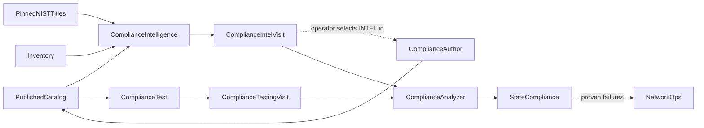

# Compliance Agents — the patient chart

Compliance uses the same patient-chart pattern as Health. Independent
specialists produce structured evidence. The primary Compliance agent reads
their files and writes SOAP to `state/compliance.json`.

## Roles

- **Compliance Intelligence** compares the published Git catalog with a
  bounded NIST title set, judges relevance to the estate, and writes current
  coverage/intel plus an append-only visit.
- **Compliance Author** converts only operator-selected `INTEL-*`
  recommendations into checks on git `compliance`.
- **Compliance Test** executes suites and writes general testing state. A
  compliance-suite run also writes an append-only compliance-testing visit.
- **Compliance** is the attending analyzer. It queries no source and runs no
  test. It trends Intelligence and Test visits, keeps two scores, and writes
  `state/compliance.json`.

Agents collaborate through files, not chat awareness.

## Evidence files

Compliance Intelligence writes:

- `compliance/coverage.json` — current accumulated control coverage
- `compliance/intel.json` — current ranked recommendation backlog, capped at
  ten
- `compliance/intel/<stamp>.json` — append-only visit metrics and change
- `compliance/metadata-intel.json` — latest Intel visit pointer

Compliance Test writes:

- `testing/<stamp>.json` and `state/testing.json` for every run
- `compliance/testing/<stamp>.json` for compliance-suite evidence
- `compliance/metadata-testing.json` as the latest compliance-test pointer

Compliance Analyzer writes:

- `state/compliance.json` only

Each evidence plane keeps ten stamps. Metadata provides `last_visit_id`; no
agent lists directories. Relationship keys such as `control:AC-3`,
`test:aaa-authorization`, and `device:WAN-01` let later readers join the
evidence.

## Intelligence loop

The Intelligence script processes the pinned NIST index inside Python and
returns at most twenty unresolved titles. The model never receives the full
framework.

The agent removes controls already covered, already classified not
applicable, or already active recommendations. It interprets the remaining
titles against inventory and maintains up to ten ranked recommendations.
It does not author tests, run tests, score posture, or invoke another agent.

## Test evidence

Compliance Test judges the `# Network test report`, not the GitHub green
check. Every detailed row carries canonical test and exact device keys plus
source-supported control keys.

A compliance visit records stable metrics and `vs_prior`. PASS/FAIL/ERROR
ran. N/A is excluded. SKIP is an evidence gap. A Dev result remains proposal
evidence rather than production proof.

## Compliance SOAP

The analyzer reads both metadata pointers, latest visits, current coverage
and intel, and its prior chart. Evidence is stale after 24 hours.

It keeps two independent scores:

- **Tested posture**:
  `verified_tests / (verified_tests + failing_tests)`. SKIP and N/A are
  excluded and reported separately.
- **Framework coverage**:
  `covered / (covered + partial + gap + unwired)`. Not-applicable controls
  are excluded; no partial credit is invented.

It folds the last ten visits per plane into series, creates structured
findings with keys and evidence refs, and writes assessment, trend, and SOAP.

Plans route work without performing it:

- stale framework evidence → Compliance Intelligence
- stale test evidence → Compliance Test
- selected missing control → Compliance Author
- proven test failure on a device/control → Network Ops
- no material next step → `none`

The analyzer does not write tests, run workflows, or change configuration.
Network Ops can later consume `state/compliance.json` as a current,
interpreted chart rather than reconstructing posture from individual runs.
