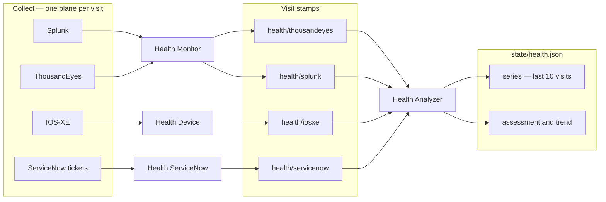

# Health Agents

Health watches the production network and says what the last visits
mean. Nurses **collect** one telemetry plane per conversation.
Health Analyzer **reasons** over those visits and the metric series
already on disk. It writes findings — what is unhealthy, what is
not, what changed, what contradicts — not a plan and not a work
queue.

One source per nurse visit. A Splunk check does not pull
ThousandEyes or IOS-XE. Live lookup ids and the Splunk watermark
live in metadata, not in the prompt. “No critical errors” is one
fact; the visit still reports volume, hosts, coverage, and what
that source measured.

Nurses do not write `state/`. Analyzer does not collect and does
not write visit files. [Network Ops](network-ops.md) reads the
chart. Lane agents decide later.

## Agents

| Agent | Role | Writes |
|-------|------|--------|
| Health Monitor | Named Splunk **or** ThousandEyes visit | That plane’s stamp and metadata |
| Health Device | IOS-XE RESTCONF GET | `health/iosxe/<stamp>.json` |
| Health ServiceNow | Read-only tickets for this lab | ServiceNow stamp and metadata |
| Health Analyzer | Analyze + trend (reasoner) | `state/health.json` only |

## Health Monitor

One named check. Unnamed invoke asks which and stops.

**Splunk** — syslog for the lab index and sourcetype. Window is the
watermark (`collected_through`), not another rolling 24 hours.
Interprets hosts, volume, flaps, and errors.

**ThousandEyes** — path tests: loss, latency, jitter, errors,
alerts, bounded path vis. Account and test ids come from metadata
or a discover-then-ask resolve.

## Health Device

Device plane only. GET interfaces, BGP, and counters. ACL GET only
when a ranked up port is dropping. Rank from `inventory/prod.json`.
Does not change config. PAT port is on inventory — there is no
IOS-XE metadata file.

## Health ServiceNow

Tickets for **this lab**, scoped by a workspace marker and
inventory labels. Shared-instance rows are out of scope. Open
in-scope tickets do not degrade vital status. This agent does not
file or update cases — that is [ServiceNow Agents](servicenow-agents.md).

## Health Analyzer

Reasoner. Not a collector and not a merger. Reads the four latest
stamps (and prior `state/health.json`), **folds** new visit
`metrics` into `series` (last 10 visits per plane), then writes
**assessment plus trend**.

Fold is mechanical: copy new `metrics` into `points`, drop oldest
past 10, set `watermark`. Same stamp again does not rewrite
history. Synthesis comes after: `assessment` (unhealthy / healthy /
contradictions / opinion) and `trend_analysis` (what changed over
the window). `headline` and each `consult.impression` are this
agent’s verdict — not pasted visit headlines. It does not invent a
root cause no stamp measured.

Freshness is 26 hours from `checked_at`. Envelope status is worst
of ThousandEyes, Splunk, and IOS-XE. ServiceNow does not vote.
Silent plane is not health.

- **assess-now** — dispatch stale planes if attached; do not wait;
  analyze what is on disk.
- **refresh-then-assess** — wait only for planes that are both
  stale and material (a WAN question does not block on ticket
  history).

`next_action` is an inspect pointer or `none`. No SKUs. No work
queue.

## Invoke lines

- `Run the Splunk health check only.`
- `Run the ThousandEyes health check only.`
- `Run the network device health check only.`
- `Run the ServiceNow health check only.`
