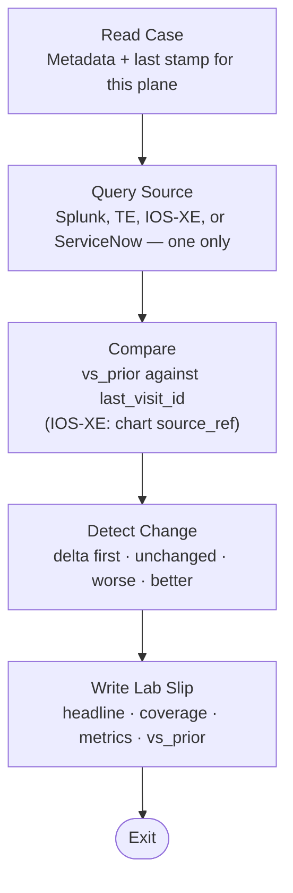

# Health Agents — the patient chart

Health is the first family that implements the
[patient-chart architecture](patient-chart.md). Nurses query **one**
telemetry source, compare it to the last visit of that source, and
write a structured **observation** (lab slip). Health Analyzer
reads those slips and writes **SOAP** on `state/health.json`.
Network Ops and Network Design start from that chart — not from
four chat recaps.


## How this family maps

| Architecture | This family |
|--------------|-------------|
| Shared case | Studio workspace (`workspace-handoff`) |
| Specialist | One telemetry source per conversation |
| Observation | Lab slip under `health/<source>/<stamp>.json` |
| Authoritative source | Splunk, ThousandEyes, IOS-XE RESTCONF, ServiceNow |
| Material change | Required `vs_prior` (`delta`, `changed[]`) |
| Evidence, not dump | `headline`, `coverage`, `metrics` — not MCP JSON |
| Interpretation | Health Analyzer SOAP on `state/health.json` |
| Plan | Named nurse visit, refer Ops/Design, or `none` |
| Action / outcome | Network Ops, Network Design, Compliance Test |

SOAP is the attending note. Nurses do not write SOAP. SBAR and
I-PASS are escalation / responsibility patterns in the
architecture; they are not the visit-file format.

A Splunk visit is labs. A ThousandEyes visit is imaging. An IOS-XE
visit is examining the patient. ServiceNow is prior-admission
history. Mixing those in one conversation is one clinician doing
everyone else’s job.

## Specialist loop



Skills own tools, thresholds, and the schema. The prompt stays
identity plus this loop. MiniMax-shaped nurses query and compare.
Analyzer spends tokens on synthesis.

**What is on the slip.** Vitals (`metrics`, same keys every visit,
`null` when not collected), coverage, and `vs_prior`. The proof of
a change is `vs_prior.changed` (for example `test:t2 ok_rounds 12 →
0`), not a copy of `tests[]`, `samples`, or `devices[]` trees.
Standing-order follow-up (TE path-vis on loss/errors) stays on
**this** visit. A Splunk finding does not authorize an IOS-XE GET.

**What a named visit still does today.** A completed collection
still writes a lab slip, including `delta: unchanged` and
`changed: []`. That is thinner than a telemetry dump, and it keeps
freshness and the series honest. Skip-write on no change is the
architecture target (`Write or Exit`); it is not the Health skill
behavior yet.

A successful Splunk search with no BGP ADJCHANGE, LINEPROTO
UPDOWN, or CONFIG_I is a quiet window: `complete`, signal counts
0, `readings` [], and the watermark advances to `checked_at`. A
tool error or an unusable payload is `unavailable`, null counts,
and the watermark stays put. ThousandEyes with an empty alert
list means no rule is bound, not a healthy path.

## Who writes what

| Role | Agent | Writes |
|------|-------|--------|
| Path / syslog | Health Monitor | Named Splunk **or** ThousandEyes slip + that plane’s metadata |
| Bedside | Health Device | `health/iosxe/<stamp>.json` |
| Records | Health ServiceNow | ServiceNow slip + metadata |
| Attending | Health Analyzer | `state/health.json` only |

Nurses never write `state/`. Analyzer never collects and never
overwrites a visit stamp. Stamps are append-only (keep ten).
[Network Ops](network-ops.md) and
[Network Design](change-and-test-agents.md) read the chart. They
do not collect these planes.

Live lookup ids, the Splunk watermark, and each plane’s
`last_visit_id` live in metadata, not in the prompt. IOS-XE PAT
lives on `inventory/prod.json`. `health/metadata-iosxe.json` holds
only `last_visit_id` and `last_collected_at`.

## Health Monitor

One named check. Unnamed invoke asks which and stops.

**Splunk** — syslog for the lab index and sourcetype. Window is
the watermark (`collected_through`), not another rolling 24 hours.

**ThousandEyes** — path tests: loss, latency, jitter, errors,
alerts. Account and test ids come from metadata. Standing order on
loss / error rounds: one path-vis on the worst direction.

## Health Device

Device plane only. GET interfaces, BGP, and counters. ACL GET only
when a ranked up port is dropping. Rank from `inventory/prod.json`.
Prior stamp is `health/metadata-iosxe.json` `last_visit_id`
(no directory list). Does not change config.

## Health ServiceNow

Tickets for **this lab**, scoped by a workspace marker and
inventory labels. Shared-instance rows are out of scope. Open
in-scope tickets do not degrade vital status. Filing cases is
[Ops ServiceNow Operator](servicenow-agents.md).

## Health Analyzer

Reasoner. Reads the four latest slips (and prior
`state/health.json`), **folds** new visit `metrics` into `series`
(last 10 per plane), then writes SOAP. Envelope status is worst of
ThousandEyes, Splunk, and IOS-XE. ServiceNow does not vote.

- **S** — why this analysis ran (the ask, or scheduled
  assess-now / refresh-then-assess).
- **O** — what the slips and series measured, including
  `vs_prior` deltas. Stamp paths stay on `consults.*.source_ref`.
- **A** — `assessment.opinion` from all four planes. Quiet planes
  are findings. Contradictions stay contradictions, not an
  invented root cause.
- **P** — another named nurse visit, refer Network Ops or Network
  Design, or `none`. Not “inspect the stamp already read.” Not a
  SKU, git change, or test plan.

Modes: **assess-now** dispatches stale planes if attached and does
not wait. **refresh-then-assess** waits only for planes that are
both stale and material.

## Example notes

Trimmed from the skill examples. Full schemas live next to each
skill.

### Wristband — Splunk metadata

`health/metadata-splunk.json`

```json
{
  "schema": "health-metadata-splunk/v1",
  "source_agent": "health-monitor",
  "splunk": {
    "index": "example",
    "sourcetype": "syslog",
    "collected_through": "2026-08-30T18:43:58Z",
    "last_visit_id": "2026-08-30T18-45-00Z"
  }
}
```

ThousandEyes metadata holds `account_id` and `tests[]`. ServiceNow
metadata holds `marker` and `last_visit_id`.

### Observation — Splunk lab slip

`health/splunk/<stamp>.json`

```json
{
  "schema": "health-splunk-check/v2",
  "source": "splunk",
  "watch_id": "2026-08-30T18-45-00Z",
  "status": "ok",
  "headline": "37 new syslog events, 7 hosts; CONFIG_I + DMI sync; 0 flaps",
  "coverage": { "state": "complete" },
  "vs_prior": {
    "prior_watch_id": "2026-08-30T04-03-20Z",
    "delta": "unchanged",
    "changed": []
  },
  "metrics": [
    {
      "at": "2026-08-30T18:45:00Z",
      "scope": "window",
      "event_count": 37,
      "critical_error_count": 0,
      "flap_count": 0,
      "unique_hosts": 7
    }
  ]
}
```

### Observation — ThousandEyes (material change)

`health/thousandeyes/<stamp>.json`

```json
{
  "schema": "health-thousandeyes-check/v2",
  "source": "thousandeyes",
  "watch_id": "2026-08-14T16-05-00Z",
  "status": "degraded",
  "headline": "path-b 30/30 errored; path-a 0% loss",
  "coverage": { "state": "complete" },
  "vs_prior": {
    "prior_watch_id": "2026-08-14T15-00-00Z",
    "delta": "worse",
    "changed": ["test:t2 ok_rounds 12 → 0", "test:t2 error_rounds 0 → 30"]
  },
  "metrics": [
    { "scope": "test:t1", "loss_pct": 0.0, "ok_rounds": 1, "error_rounds": 0 },
    { "scope": "test:t2", "loss_pct": null, "ok_rounds": 0, "error_rounds": 30 }
  ]
}
```

### Observation — IOS-XE lab slip

`health/iosxe/<stamp>.json`

```json
{
  "schema": "health-iosxe-check/v2",
  "source": "iosxe",
  "watch_id": "2026-08-31T16-00-00Z",
  "status": "ok",
  "headline": "edge-1 + wan-1: 0 oper-not-ready, BGP established, 0 errors/flaps",
  "coverage": { "state": "complete" },
  "vs_prior": {
    "prior_watch_id": "2026-08-31T10-00-00Z",
    "delta": "unchanged",
    "changed": []
  },
  "metrics": [
    { "scope": "device:wan-1", "oper_not_ready": 0, "bgp_not_established": 0, "in_errors": 0, "num_flaps": 0 }
  ]
}
```

### Observation — ServiceNow lab slip

`health/servicenow/<stamp>.json`

```json
{
  "schema": "health-servicenow-check/v2",
  "source": "servicenow",
  "watch_id": "2026-09-01T15-00-00Z",
  "status": "ok",
  "headline": "0 open lab INC / 0 open lab CHG; 14 shared-instance open ignored",
  "coverage": { "state": "complete" },
  "vs_prior": {
    "prior_watch_id": "2026-09-01T09-00-00Z",
    "delta": "unchanged",
    "changed": []
  },
  "metrics": [
    { "scope": "lab", "open_incidents": 0, "open_changes": 0, "open_p1p2": 0, "out_of_scope_open": 14 }
  ]
}
```

An in-scope open ticket does not set `status` to `degraded`.
Tickets are history, not vitals.

### SOAP — attending chart

`state/health.json`

```json
{
  "schema": "health-state/v5",
  "source_agent": "health-analyzer",
  "status": "degraded",
  "headline": "Unhealthy is the WAN path, not the lab syslog or the boxes.",
  "next_action": "Network Ops: path or config, not a down box.",
  "soap": {
    "subjective": "Scheduled assess-now.",
    "objective": "TE path-b 30/30 error rounds (worse vs prior); path-a 0% loss. Splunk 0 flaps. IOS-XE ranked wan/edge oper-ready. ServiceNow not requested.",
    "assessment": "Unhealthy is the WAN path, not the lab syslog or the boxes.",
    "plan": "Network Ops: path or config, not a down box."
  },
  "assessment": {
    "unhealthy": ["thousandeyes path-b (test t2): 30/30 error rounds this visit"],
    "healthy": ["splunk: 0 flaps, 0 critical across 7 hosts", "iosxe: ranked wan/edge oper-ready"],
    "contradictions": ["WAN path-b failed; device plane and syslog are quiet"],
    "opinion": "Unhealthy is the WAN path, not the lab syslog or the boxes."
  },
  "trend_analysis": {
    "narrative": "TE path-b flipped from ok rounds to all errors vs prior stamp; Splunk and IOS-XE stayed quiet."
  }
}
```

`consults.<plane>` is the attending’s impression of that lab slip,
not a paste of the nurse headline. `series` is the last ten
`metrics` points per plane. Stamp path stays on
`consults.*.source_ref`.

## Invoke lines

- `Run the Splunk health check only.`
- `Run the ThousandEyes health check only.`
- `Run the network device health check only.`
- `Run the ServiceNow health check only.`

Analyzer: an ask to analyze, assess, chart, or trend is
`assess-now`. Refresh first is `refresh-then-assess`.
