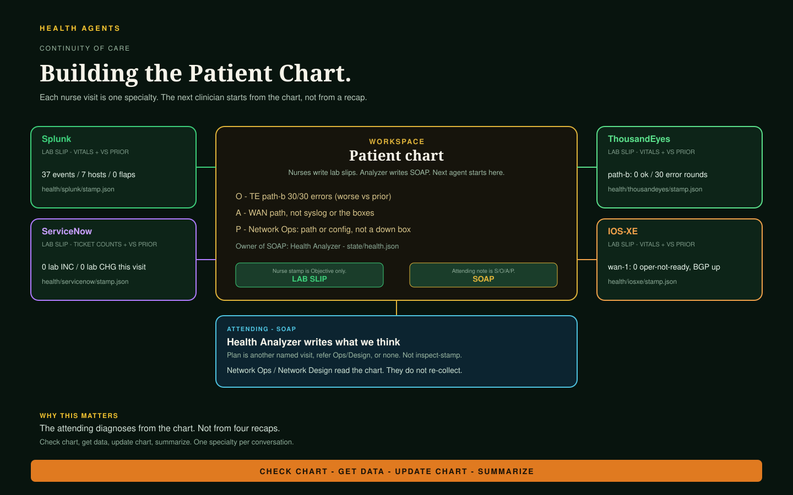

# Health Agents — the patient chart

Health is the first family that implements the
[patient-chart architecture](patient-chart.md). Nurses query **one**
telemetry source, compare it to the last visit of that source, and
write a structured **observation** (lab slip). Health Analyzer
reads those slips and writes **SOAP** on `state/health.json`.
Network Ops and Network Design start from that chart — not from
four chat recaps.



## How this family maps

| Architecture | This family |
|--------------|-------------|
| Shared case | Studio workspace (`workspace-handoff`) |
| Specialist | One telemetry source per conversation |
| Observation | Lab slip under `health/<source>/<stamp>.json` |
| Authoritative source | Splunk, ThousandEyes, IOS-XE RESTCONF, ServiceNow |
| Material change | Required `vs_prior` (`delta`, `changed[]`) |
| Evidence, not dump | `headline`, `coverage`, `metrics` — not MCP JSON |
| Interpretation | Health Analyzer SOAP on `state/health.json` |
| Plan | Named nurse visit, refer Ops/Design, or `none` |
| Action / outcome | Network Ops, Network Design, Compliance Test |

SOAP is the attending note. Nurses do not write SOAP. SBAR and
I-PASS are escalation / responsibility patterns in the
architecture; they are not the visit-file format.

A Splunk visit is labs. A ThousandEyes visit is imaging. An IOS-XE
visit is examining the patient. ServiceNow is prior-admission
history. Mixing those in one conversation is one clinician doing
everyone else’s job.

## Specialist loop


Skills own tools, thresholds, and the schema. The prompt stays
identity plus this loop. MiniMax-shaped nurses query and compare.
Analyzer spends tokens on synthesis.

**What is on the slip.** Vitals (`metrics`, same keys every visit,
`null` when not collected), coverage, and `vs_prior`. The proof of
a change is `vs_prior.changed` (for example `test:t2 ok_rounds 12 →
0`), not a copy of `tests[]`, `samples`, or `devices[]` trees.
Standing-order follow-up (TE path-vis on loss/errors) stays on
**this** visit. A Splunk finding does not authorize an IOS-XE GET.

Every structured health write also carries top-level `keys`: the
deduplicated union of source-supported device, qualified interface, site,
service, test, incident, and change identities in that record. Nested
readings and threads retain their own keys. Unavailable or entity-free writes
use `keys: []`; agents never infer identities from prose.

**What a named visit still does today.** A completed collection
still writes a lab slip, including `delta: unchanged` and
`changed: []`. That is thinner than a telemetry dump, and it keeps
freshness and the series honest. Skip-write on no change is the
architecture target (`Write or Exit`); it is not the Health skill
behavior yet.

A successful Splunk search with no BGP ADJCHANGE, LINEPROTO
UPDOWN, or CONFIG_I is a quiet window: `complete`, signal counts
0, `readings` [], and the watermark advances to `checked_at`. A
tool error or an unusable payload is `unavailable`, null counts,
and the watermark stays put. ThousandEyes with an empty alert
list means no rule is bound, not a healthy path.

## Who writes what

| Role | Agent | Writes |
|------|-------|--------|
| Path / syslog | Health Monitor | Named Splunk **or** ThousandEyes slip + that plane’s metadata |
| Bedside | Health Device | `health/iosxe/<stamp>.json` |
| Records | Health ServiceNow | ServiceNow slip + metadata |
| Attending | Health Analyzer | `state/health.json` only |

Nurses never write `state/`. Analyzer never collects and never
overwrites a visit stamp. Stamps are append-only (keep ten).
[Network Ops](network-ops.md) and
[Network Design](change-and-test-agents.md) read the chart. They
do not collect these planes.

Live lookup ids, the Splunk watermark, and each plane’s
`last_visit_id` live in metadata, not in the prompt. IOS-XE PAT
lives on `inventory/prod.json`. `health/metadata-iosxe.json` is the
IOS-XE board: `last_visit_id`, `last_collected_at`, `current[]`
(last-known rows), `series[]`, `visits[]`.

## Health Monitor

One named check. Unnamed invoke asks which and stops.

**Splunk** — syslog for the index and sourcetype in metadata. Window
is the watermark (`collected_through`), not another rolling 24 hours.
Two fixed searches: per-host bucket counts and per-subject rollup
(BGP neighbor, interface, config user, reload, ACL, failed auth).
Hosts resolve to devices by parsed hostname, then by address against
`inventory/topology-observed.json`. The board on
`health/metadata-splunk.json` holds the last state per device, kind,
and subject; a window with no material event writes the board only.

**ThousandEyes** — path tests. One network-results call per
metadata test on the metadata `window` (default `1h`), one alerts
call. One board row per test and agent: `state` from a fixed rule
(majority of rounds at or above 5% loss, mean loss ≥ 5, or no ok
round), mean and max loss, latency and jitter on the newest round,
`first_bad_round_at`, and the devices at each end (`src_device`
from the agent's IP, `dst_device` from `serverIp`, both through
`inventory/topology-observed.json` cidr). The board on
`health/metadata-thousandeyes.json` is the prior; a stamp is written
only when state, mean loss (10 points), latency (20 ms), or error
rounds moved, or a row appeared. No path-vis: the connector's
path-vis result carries hop counts, not hop addresses.

## Health Device

Device plane only, two modes. **Health**: five small filtered GETs
per device — boot time / version / reboot reason, cpu, memory,
interface state and flaps/errors, BGP sessions — one device at a
time, diffed against the board's `current[]`; a stamp only when
something material moved (reboot, state change, flaps or errors up,
threshold crossed, BGP reset). No ACL oper, no traffic rates, no CDP.
**Topology** (`Run the network topology map only.`): version,
interfaces with addresses, and CDP rows per device to
`inventory/topology-observed.json`, file rewritten after every
device; readers pair the `neighbors[]` rows. Rank from
`inventory/prod.json`. Does not change config.

## Health ServiceNow

Tickets for **this lab**. The marker is `inventory/prod.json`
`lab_title`, else `source.name`. Inventory device names are in
scope without a question. Shared-instance rows are out of scope. Open
in-scope tickets do not degrade vital status. Filing cases is
[Ops ServiceNow Operator](servicenow-agents.md).

## Health Analyzer

Reasoner. Reads the four latest slips (and prior
`state/health.json`), **folds** new visit `metrics` into `series`
(last 10 per plane), then writes SOAP. Envelope status is worst of
ThousandEyes, Splunk, and IOS-XE. ServiceNow does not vote.

- **S** — why this analysis ran (the ask, or scheduled
  assess-now / refresh-then-assess).
- **O** — what the slips and series measured, including
  `vs_prior` deltas. Stamp paths stay on `consults.*.source_ref`.
- **A** — `assessment.opinion` from all four planes. Quiet planes
  are findings. Contradictions stay contradictions, not an
  invented root cause.
- **P** — another named nurse visit, refer Network Ops or Network
  Design, or `none`. Not “inspect the stamp already read.” Not a
  SKU, git change, or test plan.

Modes: **assess-now** dispatches stale planes if attached and does
not wait. **refresh-then-assess** waits only for planes that are
both stale and material.

## Example notes

Trimmed from the skill examples. Full schemas live next to each
skill.

### Wristband — Splunk board

`health/metadata-splunk.json`

```json
{
  "schema": "health-metadata-splunk/v2",
  "source_agent": "health-monitor",
  "splunk": {
    "index": "<index>",
    "sourcetype": "<sourcetype>",
    "collected_through": "2026-08-31T21:58:14Z",
    "last_visit_id": "2026-08-31T16-00-00Z",
    "last_collected_at": "2026-08-31T22:00:00Z",
    "baseline_visit_id": "2026-08-30T09-00-00Z",
    "current": [
      { "name": "<wan-device>", "kind": "bgp", "subject": "<neighbor-address>", "keys": ["device:<wan-device>", "device:<edge-device>"], "count": 2, "at": "2026-08-31T15:41:30Z", "state": "Up", "peer": "device:<edge-device>", "detail": "" },
      { "name": "<edge-device>", "kind": "config", "subject": "<operator>", "keys": ["device:<edge-device>"], "count": 1, "at": "2026-08-31T15:55:02Z", "source_ip": "<source-ip>", "detail": "vty0" }
    ],
    "series": [ "one estate metric row per visit, ring of 10" ],
    "visits": [ "one row per visit, ring of 10, stamp_written true/false" ]
  }
}
```

ThousandEyes metadata holds `account_id` and `tests[]`. ServiceNow
metadata holds `marker` and `last_visit_id`.

### Observation — Splunk lab slip (material event)

`health/splunk/<stamp>.json` — written only when the window held a
BGP, link, config, reload, ACL log, or failed-auth event.

```json
{
  "schema": "health-splunk-check/v3",
  "source": "splunk",
  "watch_id": "2026-08-31T16-00-00Z",
  "status": "degraded",
  "headline": "<wan-device> reloaded at 15:40:12Z (Reload Command); BGP to <edge-device> Down then Up; <operator> committed config on <edge-device> from <source-ip>. 9 devices logged; 41 board rows unchanged.",
  "coverage": { "state": "complete" },
  "vs_prior": {
    "prior_watch_id": "2026-08-30T09-00-00Z",
    "delta": "worse",
    "changed": [
      { "keys": ["device:<wan-device>"], "field": "reload", "prior": null, "current": "Reload Command", "at": "2026-08-31T15:40:12Z" }
    ]
  },
  "metrics": [
    { "at": "2026-08-31T16:00:00Z", "scope": "device:<wan-device>", "name": "<wan-device>", "events": 61, "bgp_events": 2, "link_events": 2, "config_events": 0, "reload_events": 1, "acl_events": 0, "auth_ok": 6, "auth_failed": 0, "ssh_no_match": 0 }
  ],
  "readings": [
    { "name": "<wan-device>", "kind": "reload", "subject": "RELOAD", "keys": ["device:<wan-device>"], "count": 1, "at": "2026-08-31T15:40:12Z", "detail": "Reload Command", "note": "Operator-requested reload from the console, not a crash." }
  ],
  "unchanged": 41
}
```

### Observation — ThousandEyes (material change)

`health/thousandeyes/<stamp>.json` — written only when a row moved.

```json
{
  "schema": "health-thousandeyes-check/v3",
  "source": "thousandeyes",
  "watch_id": "2026-09-25T04-05-00Z",
  "status": "degraded",
  "headline": "<a2a-test-name> <cloud-agent> -> <hq-agent> recovered: 0% on 30 of 30 ok rounds since 03:12Z, was 12% (max 34%) at the baseline; the reverse still loses 17%. 2 rows unchanged; 0 alerts firing.",
  "window": "1h",
  "coverage": { "state": "complete" },
  "vs_prior": {
    "prior_watch_id": "2026-09-24T22-05-00Z",
    "delta": "better",
    "changed": [
      { "keys": ["test:<a2a-test-id>", "device:<cloud-edge>", "device:<hq-edge>"], "field": "state", "prior": "degraded", "current": "ok", "at": "2026-09-25T04:00:01Z" },
      { "keys": ["test:<a2a-test-id>", "device:<cloud-edge>", "device:<hq-edge>"], "field": "loss_pct", "prior": 12, "current": 0, "at": "2026-09-25T04:00:01Z" }
    ]
  },
  "metrics": [
    { "at": "2026-09-25T04:05:00Z", "scope": "estate", "tests": 3, "rows": 3, "degraded_rows": 1, "worst_loss_pct": 17, "worst_scope": "test:<a2a-reverse-test-id>/<hq-agent>", "error_rounds": 0, "alerts_firing": 0 }
  ],
  "readings": [
    { "scope": "test:<a2a-test-id>/<cloud-agent>", "test_id": "<a2a-test-id>", "name": "<a2a-test-name>", "agent": "<cloud-agent>", "server": "<hq-agent-ip>", "src_device": "<cloud-edge>", "dst_device": "<hq-edge>", "keys": ["test:<a2a-test-id>", "device:<cloud-edge>", "device:<hq-edge>"], "at": "2026-09-25T04:00:01Z", "state": "ok", "loss_pct": 0, "loss_max_pct": 0, "latency_ms_avg": 1.0, "jitter_ms": 0.4, "ok_rounds": 30, "bad_rounds": 0, "error_rounds": 0, "error_type": null, "first_bad_round_at": null, "note": "Forward direction is clean for the whole window; the reverse still loses 17%, so the fix so far only helped one direction." }
  ],
  "unchanged": 2,
  "baseline_ref": "health/thousandeyes/2026-09-24T22-05-00Z.json",
  "alerts": { "firing": 0, "items": [] }
}
```

### Observation — IOS-XE lab slip

`health/iosxe/<stamp>.json`

```json
{
  "schema": "health-iosxe-check/v2",
  "source": "iosxe",
  "watch_id": "2026-08-31T16-00-00Z",
  "status": "ok",
  "headline": "edge-1 + wan-1: 0 oper-not-ready, BGP established, 0 errors/flaps",
  "coverage": { "state": "complete" },
  "vs_prior": {
    "prior_watch_id": "2026-08-31T10-00-00Z",
    "delta": "unchanged",
    "changed": []
  },
  "metrics": [
    { "scope": "device:wan-1", "oper_not_ready": 0, "bgp_not_established": 0, "in_errors": 0, "num_flaps": 0 }
  ]
}
```

### Observation — ServiceNow lab slip

`health/servicenow/<stamp>.json`

```json
{
  "schema": "health-servicenow-check/v2",
  "source": "servicenow",
  "watch_id": "2026-09-01T15-00-00Z",
  "status": "ok",
  "headline": "0 open lab INC / 0 open lab CHG; 14 shared-instance open ignored",
  "coverage": { "state": "complete" },
  "vs_prior": {
    "prior_watch_id": "2026-09-01T09-00-00Z",
    "delta": "unchanged",
    "changed": []
  },
  "metrics": [
    { "scope": "lab", "open_incidents": 0, "open_changes": 0, "open_p1p2": 0, "out_of_scope_open": 14 }
  ]
}
```

An in-scope open ticket does not set `status` to `degraded`.
Tickets are history, not vitals.

### SOAP — attending chart

`state/health.json`

```json
{
  "schema": "health-state/v5",
  "source_agent": "health-analyzer",
  "status": "degraded",
  "headline": "Unhealthy is the WAN path, not the lab syslog or the boxes.",
  "next_action": "Network Ops: path or config, not a down box.",
  "soap": {
    "subjective": "Scheduled assess-now.",
    "objective": "TE path-b 30/30 error rounds (worse vs prior); path-a 0% loss. Splunk 0 flaps. IOS-XE ranked wan/edge oper-ready. ServiceNow not requested.",
    "assessment": "Unhealthy is the WAN path, not the lab syslog or the boxes.",
    "plan": "Network Ops: path or config, not a down box."
  },
  "assessment": {
    "unhealthy": ["thousandeyes path-b (test t2): 30/30 error rounds this visit"],
    "healthy": ["splunk: 0 flaps, 0 critical across 7 hosts", "iosxe: ranked wan/edge oper-ready"],
    "contradictions": ["WAN path-b failed; device plane and syslog are quiet"],
    "opinion": "Unhealthy is the WAN path, not the lab syslog or the boxes."
  },
  "trend_analysis": {
    "narrative": "TE path-b flipped from ok rounds to all errors vs prior stamp; Splunk and IOS-XE stayed quiet."
  }
}
```

`consults.<plane>` is the attending’s impression of that lab slip,
not a paste of the nurse headline. `series` is the last ten
`metrics` points per plane. Stamp path stays on
`consults.*.source_ref`.

## Invoke lines

- `Run the Splunk health check only.`
- `Run the ThousandEyes health check only.`
- `Run the network device health check only.`
- `Run the ServiceNow health check only.`

Analyzer: an ask to analyze, assess, chart, or trend is
`assess-now`. Refresh first is `refresh-then-assess`.
