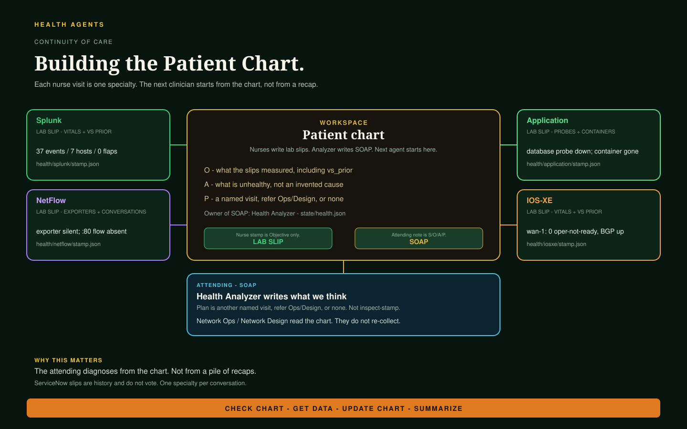
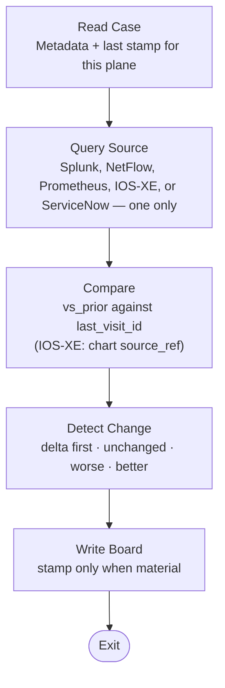

# Health Agents — the patient chart

Health is the first family that implements the
[patient-chart architecture](patient-chart.md). Nurses query **one**
telemetry source, compare it to the last visit of that source, and
write a structured **observation** (lab slip). Health Analyzer
reads the slips from the planes it still folds and writes **SOAP**
on `state/health.json`. NetFlow and application slips are on the
chart; the analyzer does not open them yet.
Network Ops and Network Design start from that chart — not from
chat recaps.



## How this family maps

| Architecture | This family |
|--------------|-------------|
| Shared case | Studio workspace (`workspace-handoff`) |
| Specialist | One telemetry source per conversation |
| Observation | Lab slip under `health/<source>/<stamp>.json` |
| Authoritative source | Splunk, Grafana (InfluxDB NetFlow, Prometheus probes / containers / hosts), IOS-XE RESTCONF, ServiceNow |
| Material change | Required `vs_prior` (`delta`, `changed[]`) |
| Evidence, not dump | `headline`, `coverage`, `metrics` — not MCP JSON |
| Interpretation | Health Analyzer SOAP on `state/health.json` |
| Plan | Named nurse visit, refer Ops/Design, or `none` |
| Action / outcome | Network Ops, Network Design, Compliance Test |

SOAP is the attending note. Nurses do not write SOAP. SBAR and
I-PASS are escalation / responsibility patterns in the
architecture; they are not the visit-file format.

A Splunk visit is labs. A NetFlow visit is who is talking to whom.
An application visit is the tiers on the host: probes, containers,
and the host OS. An IOS-XE visit is examining the patient.
ServiceNow is prior-admission history. Mixing those in one
conversation is one clinician doing everyone else’s job.

## Specialist loop


```mermaid
flowchart TB
    Read["Read Case<br/>Metadata + last stamp for this plane"]
    Query["Query Source<br/>Splunk, NetFlow, Prometheus, IOS-XE, or ServiceNow — one only"]
    Compare["Compare<br/>vs_prior against last_visit_id<br/>(IOS-XE: chart source_ref)"]
    Detect["Detect Change<br/>delta first · unchanged · worse · better"]
    Write["Write Board<br/>stamp only when material"]
    Exit([Exit])

    Read --> Query --> Compare --> Detect --> Write --> Exit
```

Skills own tools, thresholds, and the schema. The prompt stays
identity plus this loop. MiniMax-shaped nurses query and compare.
Analyzer spends tokens on synthesis.

**What is on the slip.** Vitals (`metrics`, same keys every visit,
`null` when not collected), coverage, and `vs_prior`. The proof of
a change is `vs_prior.changed` (for example `application:database`
success `1 → 0`), not a copy of `tests[]`, `samples`, or
`devices[]` trees. A Splunk finding does not authorize an IOS-XE
GET or a Grafana query. A NetFlow visit does not query Prometheus.
An application visit does not query InfluxDB.

Every structured health write also carries top-level `keys`: the
deduplicated union of source-supported device, qualified interface, site,
service, test, incident, change, and application identities in that record. Nested
readings and threads retain their own keys. Unavailable or entity-free writes
use `keys: []`; agents never infer identities from prose.

**Quiet visit.** A completed collection with no material change
writes the board only: `current[]`, `series[]`, `visits[]`, and
`last_collected_at`. No stamp. A stamp is written when something
in the material table moved, on the first visit, or when coverage
is not `complete`.

A successful Splunk search with no BGP ADJCHANGE, LINEPROTO
UPDOWN, or CONFIG_I is a quiet window: `complete`, the board
advances, and no stamp is written. A tool error or an unusable
payload is `unavailable`, null counts, and the watermark stays
put. `grafana_alerts` with no rules bound is not a healthy
estate; neither nurse designs a visit around it.

## Who writes what

| Role | Agent | Writes |
|------|-------|--------|
| Syslog / flows | Health Monitor | Named Splunk **or** NetFlow slip + that plane’s metadata |
| Application | Health Application | `health/application/<stamp>.json` + `health/metadata-application.json` |
| Bedside | Health Device | `health/iosxe/<stamp>.json` |
| Records | Health ServiceNow | ServiceNow slip + metadata |
| Attending | Health Analyzer | `state/health.json` only |

Nurses never write `state/`. Analyzer never collects and never
overwrites a visit stamp. Stamps are append-only (keep ten).
[Network Ops](network-ops.md) and
[Network Design](change-and-test-agents.md) read the chart. They
do not collect these planes.

Live lookup ids, the Splunk watermark, and each plane’s
`last_visit_id` live in metadata, not in the prompt. IOS-XE PAT
lives on `inventory/prod.json`. `health/metadata-iosxe.json` is the
IOS-XE board: `last_visit_id`, `last_collected_at`, `current[]`
(last-known rows), `series[]`, `visits[]`.

## Health Monitor

One named check. Unnamed invoke asks which and stops.

**Splunk** — syslog for the index and sourcetype in metadata. The
first visit reads 7 days; after that the window is the watermark
(`collected_through`), not another rolling 24 hours. Two fixed
searches grouped by device in Splunk: per-device bucket counts and
per-subject rollup (BGP neighbor, interface, config user, reload,
ACL, failed auth).
Hosts resolve to devices by parsed hostname, then by address against
`inventory/topology-observed.json`. The board on
`health/metadata-splunk.json` holds the last state per device, kind,
and subject; a window with no material event writes the board only.

**NetFlow** — Grafana InfluxDB, measurement in metadata (default
window `1h`). On the baseline, or when an exporter address is not
already on the board, `grafana_influx_schema` fills `exporters[]`.
Two Flux queries, `timerange` equal to that window: bytes, flows,
and last seen per exporter, then the top 40 client-to-server
conversations. Collector ports and ephemeral destination ports are
excluded in the query. Rows are `exporter` (`reporting` or
`silent`) and `conversation` (`present` or `absent`). An address
becomes a device only through `exporters[].device`, then an
`exporter_name` that matches `inventory/prod.json`, then a
topology cidr, then an access host. A port is never an
application. Material is a state flip, a new row, or bytes at
least 4× or at most ¼ of the prior. The plane is `degraded` only
when an exporter is silent. Columns `exporter`, `src_device`,
`dst_device`, `dst_port`, and `protocol` are the edge. No
`relations[]`.

## Health Application

One visit. A bare invoke runs it. Grafana Prometheus only: one
call per message.

Targets (`grafana_prometheus_targets`) are their own rows and also
name `probe_job`: any target whose scrape URL contains `/probe?`.
Twelve instant queries follow, all on the metadata window (default
`1h`):

- **Probes** — success, HTTP status, duration, and success percent
  over the window, for `{job="<probe_job>"}`.
- **Containers** — start time, CPU percent, working-set memory, and
  receive bytes per second. The `application` column and the
  `application:` key are the Prometheus `service` label, copied
  as-is. The container's `service` column is the Prometheus
  `application` label, copied as text, and it is not a key.
- **Hosts** — boot time, available memory percent, root filesystem
  free percent, and interfaces up, ignoring loopback, veth, docker,
  and bridge devices.

Annotations in the window that carry a `change:*` tag are copied
onto the board (ring of 20). On the baseline only, label values
for `service`, `site`, `vantage_point`, and `host_name` land in
`lookup`.

Rows: `probe` (`up` / `down`), `container` (`running` / `gone`),
`host` (`up` / `unreachable`), `target` (scrape `health`). `host`
is `host_name`. `device:` is written only when that name is in
`inventory/prod.json`. Probe keys include
`test:probe/<service>@<vantage_point>`. Never a `service:` key;
the registry owns those. A container or host missing from this
scrape is carried forward as `gone` or `unreachable`.

Material (a stamp): probe success or HTTP code change; container
restart (start time moved by more than 60 seconds), running↔gone,
or CPU crossing 80; host reboot, interfaces-down change, memory or
root filesystem crossing 10 percent free, or up↔unreachable;
target health change; a new row. The plane is `degraded` when a
probe is down, a container is gone or restarted this visit, a host
is unreachable or rebooted or has an interface down, or a target
is not up. Columns `host`, `device`, and `application` are the
edge. No `relations[]`.

Probe `service` labels and container `service` labels are whatever
the datasource returns. When they differ (a probe named `web` and
a container named `dc-web`), they are two `application:` keys.
Nothing in this nurse merges them.

## Health Device

Device plane only, two modes. **Health**: five small filtered GETs
per device — boot time / version / reboot reason, cpu, memory,
interface state and flaps/errors, BGP sessions — one device at a
time, diffed against the board's `current[]`; a stamp only when
something material moved (reboot, state change, flaps or errors up,
threshold crossed, BGP reset). No ACL oper, no traffic rates, no CDP.
**Topology** (`Run the network topology map only.`): version,
interfaces with addresses, and CDP rows per device to
`inventory/topology-observed.json`, file rewritten after every
device; readers pair the `neighbors[]` rows. Rank from
`inventory/prod.json`. Does not change config.

## Health ServiceNow

Tickets for **this lab**. The marker is `inventory/prod.json`
`lab_title`, else `source.name`. Inventory device names are in
scope without a question. Shared-instance rows are out of scope. Open
in-scope tickets do not degrade vital status. Filing cases is
[Ops ServiceNow Operator](servicenow-agents.md).

## Health Analyzer

Reasoner. Reads the four boards it still knows (and prior
`state/health.json`), **folds** new visit `metrics` into `series`
(last 10 per plane), then writes SOAP. Envelope status is worst of
ThousandEyes, Splunk, and IOS-XE. ServiceNow does not vote.

It does not yet open `health/metadata-netflow.json` or
`health/metadata-application.json`. Those slips are on the chart
for the next phase. The relationship compiler, the ServiceNow
registry, and Network Ops review still read
`health/metadata-thousandeyes.json` the same way. Application
impact and change blast radius are not on `state/health.json`
yet.

- **S** — why this analysis ran (the ask, or scheduled
  assess-now / refresh-then-assess).
- **O** — what the slips and series measured, including
  `vs_prior` deltas. Stamp paths stay on `consults.*.source_ref`.
- **A** — `assessment.opinion` from the four planes it reads. Quiet planes
  are findings. Contradictions stay contradictions, not an
  invented root cause.
- **P** — another named nurse visit, refer Network Ops or Network
  Design, or `none`. Not “inspect the stamp already read.” Not a
  SKU, git change, or test plan.

Modes: **assess-now** dispatches stale planes if attached and does
not wait. **refresh-then-assess** waits only for planes that are
both stale and material.

## Example notes

Trimmed from the skill examples. Full schemas live next to each
skill.

### Wristband — Splunk board

`health/metadata-splunk.json`

```json
{
  "schema": "health-metadata-splunk/v2",
  "source_agent": "health-monitor",
  "splunk": {
    "index": "<index>",
    "sourcetype": "<sourcetype>",
    "collected_through": "2026-08-31T21:58:14Z",
    "last_visit_id": "2026-08-31T16-00-00Z",
    "last_collected_at": "2026-08-31T22:00:00Z",
    "baseline_visit_id": "2026-08-30T09-00-00Z",
    "current": [
      { "name": "<wan-device>", "kind": "bgp", "subject": "<neighbor-address>", "keys": ["device:<wan-device>", "device:<edge-device>"], "count": 2, "at": "2026-08-31T15:41:30Z", "state": "Up", "peer": "device:<edge-device>", "detail": "" },
      { "name": "<edge-device>", "kind": "config", "subject": "<operator>", "keys": ["device:<edge-device>"], "count": 1, "at": "2026-08-31T15:55:02Z", "source_ip": "<source-ip>", "detail": "vty0" }
    ],
    "series": [ "one estate metric row per visit, ring of 10" ],
    "visits": [ "one row per visit, ring of 10, stamp_written true/false" ]
  }
}
```

ServiceNow metadata holds `marker` and `last_visit_id`. NetFlow
and application boards are below.

### Observation — Splunk lab slip (material event)

`health/splunk/<stamp>.json` — written only when the window held a
BGP, link, config, reload, ACL log, or failed-auth event.

```json
{
  "schema": "health-splunk-check/v3",
  "source": "splunk",
  "watch_id": "2026-08-31T16-00-00Z",
  "status": "degraded",
  "headline": "<wan-device> reloaded at 15:40:12Z (Reload Command); BGP to <edge-device> Down then Up; <operator> committed config on <edge-device> from <source-ip>. 9 devices logged; 41 board rows unchanged.",
  "coverage": { "state": "complete" },
  "vs_prior": {
    "prior_watch_id": "2026-08-30T09-00-00Z",
    "delta": "worse",
    "changed": [
      { "keys": ["device:<wan-device>"], "field": "reload", "prior": null, "current": "Reload Command", "at": "2026-08-31T15:40:12Z" }
    ]
  },
  "metrics": [
    { "at": "2026-08-31T16:00:00Z", "scope": "device:<wan-device>", "name": "<wan-device>", "events": 61, "bgp_events": 2, "link_events": 2, "config_events": 0, "reload_events": 1, "acl_events": 0, "auth_ok": 6, "auth_failed": 0, "ssh_no_match": 0 }
  ],
  "readings": [
    { "name": "<wan-device>", "kind": "reload", "subject": "RELOAD", "keys": ["device:<wan-device>"], "count": 1, "at": "2026-08-31T15:40:12Z", "detail": "Reload Command", "note": "Operator-requested reload from the console, not a crash." }
  ],
  "unchanged": 41
}
```

### Wristband — NetFlow board

`health/metadata-netflow.json`

```json
{
  "schema": "health-metadata-netflow/v1",
  "source_agent": "health-monitor",
  "netflow": {
    "bucket": "<bucket>",
    "measurement": "<measurement>",
    "window": "1h",
    "exporters": [
      { "source": "<hq-edge-ip>", "exporter_name": "<hq-edge>", "device": "<hq-edge>" }
    ],
    "current": [
      { "kind": "exporter", "source": "<hq-edge-ip>", "device": "<hq-edge>", "keys": ["device:<hq-edge>"], "state": "reporting", "bytes": 61659, "flows": 255 },
      { "kind": "conversation", "exporter": "<dc-edge>", "src": "<client-ip>", "dst": "<web-ip>", "dst_port": "80", "protocol": "tcp", "src_device": null, "dst_device": null, "keys": ["device:<dc-edge>"], "state": "present", "bytes": 17000, "flows": 40 }
    ]
  }
}
```

### Observation — NetFlow (material change)

`health/netflow/<stamp>.json` — written only when an exporter went
silent or returned, or a conversation appeared, vanished, or moved
by the fixed factor.

```json
{
  "schema": "health-netflow-check/v1",
  "source": "netflow",
  "watch_id": "2026-09-30T21-20-00Z",
  "status": "degraded",
  "headline": "Exporter at <cloud-edge-ip> silent since 19:41 (unresolved); <hq-edge> client to web :80 vanished. 36 rows unchanged.",
  "window": "1h",
  "coverage": { "state": "complete" },
  "vs_prior": {
    "prior_watch_id": "2026-09-30T15-20-00Z",
    "delta": "worse",
    "changed": [
      { "keys": [], "field": "state", "prior": "reporting", "current": "silent", "at": "2026-09-30T21:20:00Z" },
      { "keys": ["device:<hq-edge>"], "field": "state", "prior": "present", "current": "absent", "at": "2026-09-30T21:20:00Z" }
    ]
  },
  "metrics": [
    { "at": "2026-09-30T21:20:00Z", "scope": "estate", "exporters": 3, "exporters_silent": 1, "conversations": 38, "conversations_absent": 2 }
  ]
}
```

### Wristband — application board

`health/metadata-application.json`

```json
{
  "schema": "health-metadata-application/v1",
  "source_agent": "health-application",
  "application": {
    "probe_job": "<probe-job>",
    "window": "1h",
    "lookup": { "services": ["web", "api", "database", "dc-web", "dc-api", "dc-database"], "sites": ["datacenter", "cloud"], "vantage_points": ["cloud"], "hosts": ["<app-host>"] },
    "current": [
      { "kind": "probe", "application": "web", "vantage_site": "cloud", "state": "up", "success": 1, "http_code": 200, "keys": ["application:web", "test:probe/web@cloud"] },
      { "kind": "container", "name": "dc-web", "host": "<app-host>", "device": "<app-host>", "application": "dc-web", "service": "<business-service>", "state": "running", "cpu_pct": 0.3, "keys": ["application:dc-web", "device:<app-host>"] },
      { "kind": "host", "host": "<app-host>", "device": "<app-host>", "state": "up", "mem_available_pct": 71, "fs_root_avail_pct": 82, "interfaces_down": [], "keys": ["device:<app-host>"] }
    ],
    "annotations": []
  }
}
```

### Observation — application (material change)

`health/application/<stamp>.json` — written only when a probe,
container, host, or target row moved.

```json
{
  "schema": "health-application-check/v1",
  "source": "application",
  "watch_id": "2026-09-29T16-00-00Z",
  "status": "degraded",
  "headline": "database probe from cloud down (HTTP 0); container dc-database on <app-host> gone. 7 rows unchanged.",
  "window": "1h",
  "coverage": { "state": "complete" },
  "vs_prior": {
    "prior_watch_id": "2026-09-29T15-00-00Z",
    "delta": "worse",
    "changed": [
      { "keys": ["application:database", "test:probe/database@cloud"], "field": "success", "prior": 1, "current": 0, "at": "2026-09-29T16:00:00Z" },
      { "keys": ["application:dc-database", "device:<app-host>"], "field": "state", "prior": "running", "current": "gone", "at": "2026-09-29T16:00:00Z" }
    ]
  },
  "metrics": [
    { "at": "2026-09-29T16:00:00Z", "scope": "estate", "probes": 3, "probes_down": 1, "containers": 4, "containers_gone": 1, "hosts": 2, "targets_down": 0 }
  ]
}
```

### Observation — IOS-XE lab slip

`health/iosxe/<stamp>.json`

```json
{
  "schema": "health-iosxe-check/v2",
  "source": "iosxe",
  "watch_id": "2026-08-31T16-00-00Z",
  "status": "ok",
  "headline": "edge-1 + wan-1: 0 oper-not-ready, BGP established, 0 errors/flaps",
  "coverage": { "state": "complete" },
  "vs_prior": {
    "prior_watch_id": "2026-08-31T10-00-00Z",
    "delta": "unchanged",
    "changed": []
  },
  "metrics": [
    { "scope": "device:wan-1", "oper_not_ready": 0, "bgp_not_established": 0, "in_errors": 0, "num_flaps": 0 }
  ]
}
```

### Observation — ServiceNow lab slip

`health/servicenow/<stamp>.json`

```json
{
  "schema": "health-servicenow-check/v2",
  "source": "servicenow",
  "watch_id": "2026-09-01T15-00-00Z",
  "status": "ok",
  "headline": "0 open lab INC / 0 open lab CHG; 14 shared-instance open ignored",
  "coverage": { "state": "complete" },
  "vs_prior": {
    "prior_watch_id": "2026-09-01T09-00-00Z",
    "delta": "unchanged",
    "changed": []
  },
  "metrics": [
    { "scope": "lab", "open_incidents": 0, "open_changes": 0, "open_p1p2": 0, "out_of_scope_open": 14 }
  ]
}
```

An in-scope open ticket does not set `status` to `degraded`.
Tickets are history, not vitals.

### SOAP — attending chart

What Analyzer 4.0.1 writes today, from ThousandEyes, Splunk, and
IOS-XE. It does not yet name a NetFlow exporter or an application
probe.

`state/health.json`

```json
{
  "schema": "health-state/v5",
  "source_agent": "health-analyzer",
  "status": "degraded",
  "headline": "Unhealthy is the WAN path, not the lab syslog or the boxes.",
  "next_action": "Network Ops: path or config, not a down box.",
  "soap": {
    "subjective": "Scheduled assess-now.",
    "objective": "TE path-b 30/30 error rounds (worse vs prior); path-a 0% loss. Splunk 0 flaps. IOS-XE ranked wan/edge oper-ready. ServiceNow not requested.",
    "assessment": "Unhealthy is the WAN path, not the lab syslog or the boxes.",
    "plan": "Network Ops: path or config, not a down box."
  },
  "assessment": {
    "unhealthy": ["thousandeyes path-b (test t2): 30/30 error rounds this visit"],
    "healthy": ["splunk: 0 flaps, 0 critical across 7 hosts", "iosxe: ranked wan/edge oper-ready"],
    "contradictions": ["WAN path-b failed; device plane and syslog are quiet"],
    "opinion": "Unhealthy is the WAN path, not the lab syslog or the boxes."
  },
  "trend_analysis": {
    "narrative": "TE path-b flipped from ok rounds to all errors vs prior stamp; Splunk and IOS-XE stayed quiet."
  }
}
```

`consults.<plane>` is the attending’s impression of that lab slip,
not a paste of the nurse headline. `series` is the last ten
`metrics` points per plane. Stamp path stays on
`consults.*.source_ref`. The planes in that note are the ones
Analyzer 4.0.1 still reads.

## Invoke lines

- `Run the Splunk health check only.`
- `Run the NetFlow health check only.`
- `Run the application health check only.`
- `Run the network device health check only.`
- `Run the ServiceNow health check only.`

An unnamed Health Monitor invoke asks which check — Splunk or
NetFlow — and stops. Health Application has one visit; a bare
invoke runs it.

Analyzer: an ask to analyze, assess, chart, or trend is
`assess-now`. Refresh first is `refresh-then-assess`.
