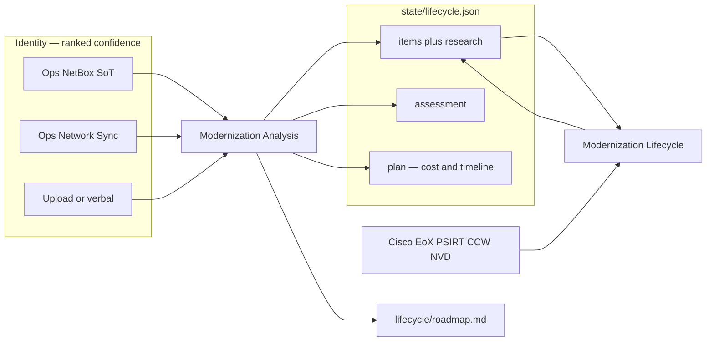

# Modernization Agents

Refresh: what is in the estate, how sure we are, what Cisco says,
and what to do next — with cost and a timeline.

Identity comes from SoT, inventory, upload, or verbal as written
(`device_type` / `node_definition` / serial PID). Never a
hostname-to-SKU map. Confidence is ranked: live facts `high`,
NetBox/Sync `medium`, upload/verbal `low`. Do not overwrite high
with lower unless they override.

Modernization Analysis **ingests and reasons**. Modernization
Lifecycle **collects** Cisco research. They share one estate
table.

## Agents

| Agent | Role |
|-------|------|
| Modernization Analysis | Ingest + rank confidence. Assessment. Plan with cost and timelines. |
| Modernization Lifecycle | Hardware EoX, software train, PSIRT, NVD, CCW onto existing rows |

## Estate

`state/lifecycle.json` is one row per evidence product id. The
operator’s selected SKU lives only on that row.

Analysis writes `guidance` (confidence), `assessment` (must
move / can wait / contradictions / opinion), and `plan` (cost
rolled from prices already on rows, timeline stages). Headline
and opinions are this agent’s verdict. `lifecycle/roadmap.md`
is the human sequence after they answered.

Lifecycle writes Cisco facts onto matching `pid` rows and dumps
detail at `lifecycle/items/<pid>.json`. It copies through
assessment and plan. It does not invent a replacement SKU.
Family-only bulletin becomes an ask on the row.
`recommended_software` comes from Cisco software EoX / PSIRT,
never from a CCW part number. Empty hardware EoX on a virtual
PID is unavailable research, not a failed estate.

## How a refresh runs

1. Analysis seeds identity from inventory / NetBox / upload /
   verbal and ranks confidence.
2. Missing or expired research: `Run the Modernization Lifecycle
   check only.` Invoke and continue — do not wait.
3. Lifecycle merges research and writes the per-PID dump.
4. Plan invoke: Analysis asks why, then the choice. After
   answers, it fills `assessment` and `plan` (list cost from
   CCW already on the row — null stays null) and writes the
   roadmap.

A plan invoke may **read** [Health Agents](health-agents.md)
`state/health.json`. It does not collect telemetry and does not
write the health chart.
