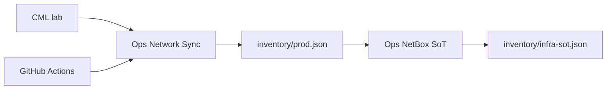

# SoT and Twin Agents

The systems of record stay outside the workspace. These agents keep
the chart honest: what devices exist, what config GitHub has, and
whether the lab still matches prod.

| System | Role |
|--------|------|
| GitHub | Full running-configs. Ops Network Sync + Actions collect from IOS-XE. |
| NetBox | Devices, types, interfaces, IPs, cables — enough to rebuild CML. Not a second config dump. |
| Twin (CML) | Bootstrap → OOB → IOS-XE, then push GitHub configs. |

## Agents

| Agent | Role |
|-------|------|
| Onboard | Workspace control board. Turns inventory / config sync / NetBox planes on. Reset flips sync and NetBox off and runs them again. |
| Ops Network Sync | Access inventory and the Actions runner (collect, push, drift). Runs twin workflows only when Twin names them. |
| Ops NetBox SoT | Puts infrastructure into NetBox from Sync seed + live IOS-XE / CDP. |
| Digital Twin | Owns deploy and reconcile of the lab. Prints a plan, waits for go, then Sync runs the Actions. |

## Ops Network Sync

Owns workspace inventory and config SoT through GitHub Actions. It
does not write NetBox and it does not own building the twin.

Empty workspace: create `inventory/prod.json`. Existing files:
collect and merge — it does not wipe unknown or user-authored
fields. Those files are the published PAT/SSH snapshot. Health
Device reads the RESTCONF port from here.

After every invoke it writes `state/network-sync.json` last. That
file is this operation only. A failed collect updates the attempt
and leaves last-known-good inventory alone.

Config jobs (capture prod, push dev, detect drift) go through
Actions. It reports the job-log marker, not the green check. A
green job with failed devices is gaps, never ok.

`deploy-twin.yml` / `reconcile-dev.yml` are Digital Twin’s product.
Sync is the runner when Twin names those files.

After a successful CML collect it compares simulate-tagged devices
to `inventory/infra-sot.json`. Match → stop. Mismatch → next action
is populate NetBox.

## Ops NetBox SoT

Owns infrastructure in NetBox: devices, types, interfaces, IPs,
cables. GitHub / Sync owns running-configs.

It opens `inventory/prod.json` first. Missing → stop. Seed is
devices tagged `tag:simulate`. Then one mode:

- **bootstrap** — create things that are missing. Do not update
  existing ids.
- **audit** — compare seed + live boxes to NetBox. No writes.
  Refresh / sync NetBox / update NetBox mean this.
- **reconcile** — apply an approved diff set only.

When GET is required it reads the boxes over RESTCONF (version,
interfaces, CDP). Ports come from inventory. It maps those rows
into NetBox itself.

It writes `inventory/infra-sot.json` (id map), then
`state/netbox.json` (summary + wiring). The operator result is who
is connected to whom. Counts without links are not a finished job.

## What readers use

- `inventory/prod.json` — published access snapshot (RESTCONF
  ports, identity).
- `inventory/infra-sot.json` — NetBox ids, interfaces, cables,
  software version.
- `state/network-sync.json` — this collect only; last-known-good
  snapshot is preserved on a failed collect.
- `state/netbox.json` — mode, counts, seed match, links.
- `state/workspace.json` — Onboard only: which planes are up.

The twin is a gate, not a planner. A passing test on a drifted lab
is not evidence. Fidelity cites Sync drift — it does not copy
configs into state.
